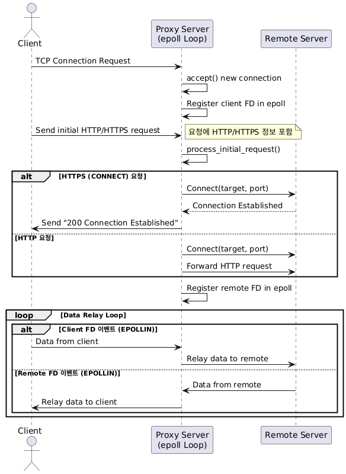

# Epoll 기반 멀티플렉싱 HTTP/HTTPS 프록시 서버

이 프로젝트는 **epoll**을 이용한 I/O 멀티플렉싱 방식으로 동작하는 HTTP/HTTPS 프록시 서버입니다.  
하나의 프로세스 내에서 수많은 클라이언트 연결을 효율적으로 관리하며, 다음과 같은 기능을 제공합니다.

## 특징

- **HTTP/HTTPS 지원**  
  - HTTP 요청은 원격 서버로 직접 전달  
  - HTTPS 요청은 CONNECT 방식을 통해 터널링 지원

- **epoll 기반 I/O 멀티플렉싱**  
  - 단일 프로세스 내에서 다수의 소켓 이벤트를 효율적으로 처리

- **매개변수 기반 포트 설정**  
  - 실행 시 포트 번호를 인자로 받아 설정 (기본 포트: 8888)

- **도메인 차단 기능**  
  - `blocked.txt` 파일에 차단할 도메인을 추가하면, 해당 도메인에 대한 요청 시  
    403 Forbidden 응답과 함께 차단 페이지(`403message.html`)를 표시

## 파일 구성

- **main.c**: 서버 초기화 및 리스닝 소켓 설정, epoll 이벤트 루프 실행  
- **proxy.c**, **proxy.h**: 프록시 요청 처리, 차단 도메인 체크, epoll 기반 데이터 중계 관련 함수 정의  
- **blocked.txt**: 차단할 도메인 목록 파일  
- **403message.html**: 차단 시 클라이언트에 출력할 HTML 페이지  
- **Makefile**: 프로젝트 빌드를 위한 스크립트  
- **README.md**: 프로젝트 설명  
- **images/**: 다이어그램 등 README 관련 이미지

## 빌드 및 실행

1. **빌드**  
   터미널에서 다음 명령어를 실행합니다.
   ```bash
   make
   ```
2. **실행**
   기본 포트(8888)로 실행:
  ```BASH
  ./proxy
  ```
  또는 포트를 지정하여 실행:
  ```bash
  ./proxy 8080
  ```

## 주의점
- 프록시 접속이 되지 않을 경우, 방화벽 설정이나 포트 충돌을 확인하세요.
- HTTPS 터널링의 경우, 클라이언트에서는 SSL 핸드셰이크가 발생하므로
  프록시 서버가 403 응답을 전송하면 브라우저에서 별도의 오류 메시지가 표시될 수 있습니다.

## 시퀀스 다이어그램

